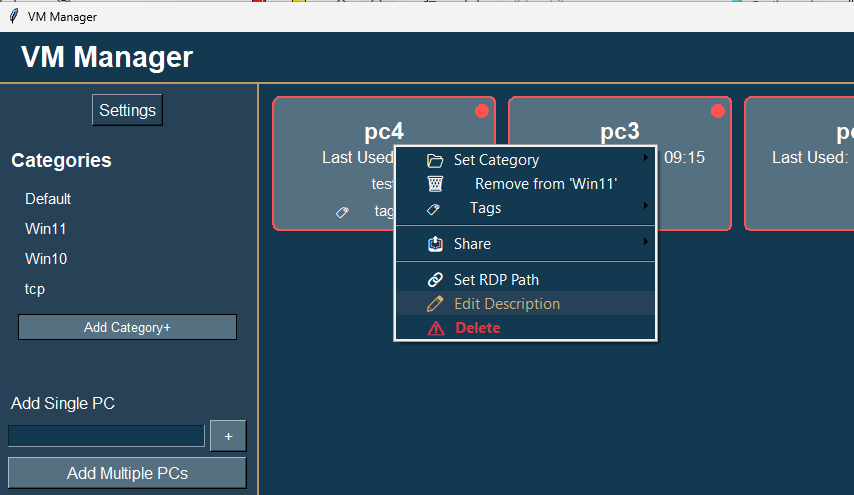

# VM Manager - How To Guide

## Table of Contents
- [Initial Setup](#initial-setup)
- [Adding Virtual Machines](#adding-virtual-machines)
- [Managing Categories](#managing-categories)
- [Managing Tags](#managing-tags)
- [Connecting to Machines](#connecting-to-machines)
- [Managing Machines](#managing-machines)
- [Customizing Settings](#customizing-settings)
- [Sharing Machines](#sharing-machines)
- [Tips and Tricks](#tips-and-tricks)
## Initial Setup

### First Launch
When you first launch VM Manager, you'll be prompted to select a default RDP file:

1. Click "OK" on the prompt
2. Browse to select your default RDP file
3. The application will create necessary folders automatically

### Theme Selection
VM Manager supports both light and dark themes:

1. Click the theme toggle (☀️/🌙) in the header
2. Theme changes apply immediately
3. Selection persists between sessions
## Adding Virtual Machines

### Adding a Single Machine
You can add machines one at a time using the sidebar:

1. Enter the machine name in the "Add Single PC" field
2. Click "Add PC"
3. The machine will appear in the main view

### Adding Multiple Machines
For batch additions:

1. Enter machine names in the text area (one per line)
2. Click "Add PCs"
3. All machines will be added to the main view
## Managing Categories

### Creating and Managing Categories
To organize your machines into categories:

1. Click the large "Add Category+" button in the sidebar
2. Add a new category:
   - Enter category name
   - Choose category color from the color palette
   - Click OK to create

3. Category Features:
   - Hover effects for better interaction
   - Checkmark indicators for selected categories
   - Color indicators on machine tiles showing category assignment
   - Right-click menu for category management

4. Managing Existing Categories:
   - Right-click any category for options:
     * Rename category
     * Change category color
     * Delete category
   - Selected categories show checkmark indicators
   - Click again to deselect a category

### Category Organization

Tips for effective category management:

1. Use clear, descriptive category names
2. Assign distinct colors for visual organization
3. Use the category indicator on machine tiles for quick reference
4. Categories can be renamed without losing assignments
5. Click categories to toggle filtering
6. Categories can be edited or deleted through the right-click menu
7. Drag and drop categories to reorder them (except Default)

### Category Reordering
To reorganize your categories:

1. Click and hold any category (except Default)
2. Drag the category up or down to the desired position
3. Release to drop the category in its new position
4. The new order is automatically saved

Tips for category organization:

- Default category always stays at the top
- Most used categories can be moved to the top for easy access
- Related categories can be grouped together
- Order is preserved between sessions
## Managing Tags

### Creating and Managing Tags
To use the tagging system:

1. Add tags:
   - Click "Add Tag+" in the sidebar
   - Enter new tag name in the dialog
   - Click "OK" or press Enter
   - Tags will appear in the sidebar grid layout

2. Assign tags to machines:
   - Method 1: Drag and drop
     * Drag a tag from the sidebar onto any machine
     * The tag will be assigned instantly
   - Method 2: Right-click menu
     * Right-click any machine
     * Select "Manage Tags"
     * Check/uncheck tags to assign/remove them

3. Filter by tags:
   - Click tags in the sidebar to filter machines
   - Select multiple tags to combine filters
   - Selected tags will be highlighted
   - Click a selected tag again to deselect it
   - Machines must match all selected tags to be shown

### Managing Existing Tags
- Right-click any tag in the sidebar for options:
  * Remove tag (will remove from all machines)
  * View machines using this tag
- Hover over tags to see tooltips with additional information
- Tags are automatically saved and persist between sessions

### Tag Organization Tips
1. Use consistent naming conventions
2. Keep tags simple and descriptive
3. Combine tags with categories for better organization
4. Use drag-and-drop for quick assignment
5. Regular cleanup of unused tags
6. Multiple tags can be assigned to the same machine

### Tag Filtering Strategy
- Tags work alongside category filters
- Combining multiple tags creates more specific filters
- Active filters are visually highlighted
- Clear filters by deselecting tags
- Tag filters update the machine view in real-time
## Connecting to Machines

### Basic Connection
To connect to a machine:

1. Click on any machine tile
2. The RDP connection will launch automatically
3. Status indicator shows if machine is available (green) or unavailable (red)

### Custom RDP Connections
To use a specific RDP configuration:

1. Right-click the machine
2. Select "Set RDP Path"
3. Choose your custom RDP file
4. Future connections will use this configuration
## Managing Machines

### Context Menu Options
Right-click any machine to access management options:

1. Add/Edit Description
2. Set Custom RDP Path
3. Share Machine Configuration
4. Delete Machine

### Adding Descriptions
To add a description:

1. Right-click the machine
2. Select "Add or Edit Description"
3. Enter your description
4. Click OK
## Customizing Settings

### Settings Panel

Access application settings:

1. Click the Settings button in the sidebar
2. Settings are organized into categories:
   - **Machine Settings**:
     - Default RDP File: Choose a different RDP template file
     - Machine sharing options
     - Custom RDP configurations
   - **Application Settings**:
     - Status Refresh Interval: Control check frequency
     - Data Directory: Change storage location
     - Theme preferences
   - **User Preferences**:
     - Display options
     - Behavior settings
   - **Import/Export**:
     - Settings backup/restore
     - Machine list management
     - Shared configurations

### Changing Default RDP File
To change the default RDP configuration:

1. Open Settings
2. Navigate to Machine Settings
3. Click "Change Default RDP File"
4. Browse to select your new RDP template file
5. Click OK to save

*Note: This affects new connections only. Existing machine-specific RDP settings are preserved.*

### Adjusting Status Refresh
To modify how often machine status is checked:

1. Open Settings
2. Go to Application Settings
3. Find the "Status Refresh Interval" setting
4. Enter your preferred interval in seconds
5. Click Save

*Tip: A longer interval reduces network traffic but makes status updates less frequent.*
## Sharing Machines

### Exporting Machine Configurations
To share machine settings with others:

1. Right-click the machine you want to share
2. Select "Share Machine Configuration"
3. Choose which settings to include:
   - RDP configuration
   - Machine description
   - Custom paths
4. Click "Export" and choose save location

### Importing Shared Machines
To import shared machine configurations:

1. Open Settings
2. Go to Import/Export section
3. Click "Import Shared Configuration"
4. Browse to the shared configuration file
5. Review and confirm the import

*Note: Imported settings will not override existing machines unless specified.*

### Managing Shared Configurations
To manage your shared machines:

1. Open Settings
2. Navigate to Import/Export
3. View shared configuration history
4. Remove old shared configurations
5. Update sharing preferences
## Tips and Tricks

### Status Monitoring
- Green indicator: Machine is available
- Red indicator: Machine is unavailable
- Last used time updates automatically

### Keyboard Shortcuts
- `Enter` in single machine field to quickly add
- Right-click for context menu
- Mouse wheel to scroll through machines
- `Ctrl+S` to quickly share selected machine
- `Ctrl+I` to import configurations
- `Ctrl+E` to export settings

### Best Practices
1. Use descriptive names for machines
2. Add descriptions for better organization
3. Regular exports for backup
4. Customize RDP settings for specific needs
5. Share configurations with team members
6. Keep shared configurations organized
7. Review and update machine settings periodically

### Troubleshooting Common Issues
1. **Connection Problems**
   - Verify machine name
   - Check network connectivity
   - Confirm RDP port access

2. **Sharing Issues**
   - Verify file permissions
   - Check configuration completeness
   - Ensure compatible settings

3. **Settings Issues**
   - Clear application cache
   - Verify write permissions
   - Check available disk space

*For additional support, consult the full documentation or contact support.*
